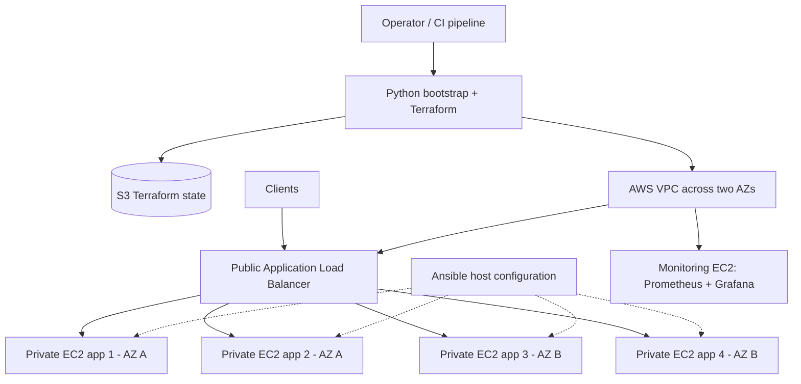

# RollingDeployment

**AWS infrastructure provisioning and deployment automation for Dockerized applications.**

RollingDeployment is a work-in-progress DevOps project that combines **Terraform**, **Python (Boto3)**, **Ansible**, and cross-platform setup scripts to prepare AWS infrastructure for rolling application deployments.

> **Project status:** Infrastructure provisioning and bootstrap automation are under development. Docker installation across EC2 instances, rolling updates, health-gated releases, and automated rollback are project goals; do not assume they are fully operational without testing.

## Goals

- Provision repeatable AWS infrastructure across multiple Availability Zones.
- Keep application servers in private subnets behind an Application Load Balancer.
- Configure EC2 hosts consistently, including Docker Engine and the Compose plugin.
- Deploy application versions gradually while preserving service availability.
- Validate instance health and recover safely from failed releases.
- Monitor application and infrastructure health with Prometheus and Grafana.

## Architecture (target design)



This diagram represents the **intended architecture**, not a claim that every component has been provisioned and verified end to end. The intended deployment uses four application EC2 instances and a separate monitoring instance. Prometheus and internal metrics should remain private; any externally accessible Grafana endpoint must be protected.

## Technology stack

| Area | Technology | Purpose |
| --- | --- | --- |
| Infrastructure | Terraform, AWS | Provision network, compute, and load balancing |
| Bootstrap | Python, Boto3 | Prepare the remote Terraform state backend and run Terraform |
| State | Amazon S3 | Versioned Terraform state with native S3 locking |
| Host configuration | Ansible | Consistent EC2 configuration and Docker installation (in progress) |
| Containers | Docker, Docker Compose | Run containerized applications (target workflow) |
| Monitoring | Prometheus, Grafana | Metrics and dashboards (planned integration) |
| Entrypoints | Bash, PowerShell | Cross-platform local setup |

## Repository layout

```text
RollingDeployment/
├── ansible/          # Host configuration and automation
├── config/           # Python bootstrap helpers
├── infra/            # Terraform infrastructure
├── keys/             # Locally generated SSH key material (keep private keys out of Git)
├── scripts/          # Linux and Windows setup scripts
├── deploy.sh         # Linux bootstrap entrypoint
├── deploy.ps1        # Windows bootstrap entrypoint
├── main.py           # S3 backend setup and Terraform init/plan/apply
├── example.env       # Configuration template
└── requirements.txt  # Python dependencies
```

## Prerequisites

- An AWS account with permissions to create and manage the resources defined in `infra/`.
- AWS credentials available through the standard AWS SDK credential chain (for example, a configured AWS profile or environment variables).
- Git and a compatible shell: Bash on Linux, or PowerShell on Windows.
- Python and Terraform, or the ability to install them using the included setup scripts.
- Network access to AWS APIs and package repositories.
- Awareness that provisioning AWS resources **can incur charges**.

For security, prefer short-lived credentials or an assumed IAM role over long-lived access keys. Do not commit `.env`, private SSH keys, Terraform state, or saved Terraform plans.

## Quick start

### 1. Clone the repository

```bash
git clone https://github.com/StasX/RollingDeployment.git
cd RollingDeployment
```

### 2. Configure the environment

Linux/macOS-style shell:

```bash
cp example.env .env
```

PowerShell:

```powershell
Copy-Item example.env .env
```

Edit `.env` for your environment. The current template contains:

| Variable | Example | Description |
| --- | --- | --- |
| `PROJECT_NAME` | `TheSchool` | Project identifier; currently also used as the Terraform state S3 bucket name |
| `REGION` | `us-east-1` | AWS region |
| `MOST_RECENT` | `true` | Terraform AMI-selection input |
| `AMI_ID` | *(empty)* | Optional AMI input; verify the corresponding Terraform logic |
| `USE_DOMAIN` | `false` | Domain-related Terraform input |
| `DOMAIN_NAME` | *(empty)* | Domain name if domain integration is enabled |
| `ADMIN_ALLOWED_CIDR` | `0.0.0.0` | Admin network input; **replace with an explicitly approved, restrictive CIDR and verify Terraform validation before applying** |

**Important:** S3 bucket names are globally unique. Choose a valid, unique `PROJECT_NAME` compatible with S3 bucket naming rules, or update the backend naming strategy before running the bootstrap. Review all variables in `infra/` before applying, especially any networking or administrative access settings.

### 3. Run the setup script

Linux:

```bash
bash ./deploy.sh
```

Windows PowerShell:

```powershell
.\deploy.ps1
```

These scripts load `.env`, export Terraform input variables, prepare local tooling and SSH key material, install Python dependencies in a virtual environment, and invoke `main.py`.

**The scripts currently invoke `main.py` without `--apply`, so they perform a Terraform plan rather than applying infrastructure changes.**

### 4. Review and apply infrastructure changes

After reviewing the plan, use the Python entrypoint with `--apply`:

Linux:

```bash
./env/bin/python main.py --apply
```

Windows PowerShell:

```powershell
.\env\Scripts\python.exe .\main.py --apply
```

Ensure the environment variables from `.env` are loaded into the current shell before invoking `main.py` directly; running the earlier setup script does not necessarily preserve exported variables in the parent shell. The `--apply` option creates a new saved plan and applies it; it does **not** merely apply a previously reviewed plan from an earlier run.

## Terraform backend

The Python bootstrap currently:

1. Checks for an S3 bucket named by `PROJECT_NAME` and creates it if missing.
2. Configures or checks S3 public-access blocking and bucket versioning.
3. Initializes Terraform using the S3 backend.
4. Uses `env/terraform.tfstate` as the backend state key and `use_lockfile=true` for state locking.
5. Runs `terraform plan -out=tfplan`.
6. Runs `terraform apply tfplan` **only** when `--apply` is passed.

Terraform state and plan files can contain sensitive information. Keep access tightly scoped and verify bucket encryption, IAM permissions, state recovery procedures, and `.gitignore` rules before production use.

## EC2 configuration and Docker

The intended next stage is to use Ansible to install and configure Docker Engine and the Docker Compose plugin on all application instances. The monitoring instance may also use Docker to run Prometheus and Grafana.

A complete host-configuration workflow should:

- Discover or inventory all intended EC2 hosts.
- Access private hosts securely, using a controlled SSH route or AWS Systems Manager.
- Install Docker packages from trusted repositories.
- Enable and start the Docker service.
- Verify Docker and Compose versions and service health.
- Remain idempotent when executed multiple times.

**Status:** An `ansible/` directory exists, but the complete installation workflow and its successful execution across every EC2 instance have not been verified here.

## Rolling deployment (planned)

The release workflow is intended to:

1. Build and publish a versioned application image.
2. Select one healthy application instance at a time.
3. Temporarily remove or drain that instance from serving requests.
4. Pull and start the new application version.
5. Wait for application health checks and target-group readiness.
6. Return the updated instance to service.
7. Continue to the next instance only after successful validation.
8. Stop and roll back according to a defined policy if validation fails.

A **zero-downtime** claim requires real load testing, readiness checks, connection-draining behavior, and failure testing; it is not guaranteed by the rolling sequence alone.

## Security considerations

- Restrict administrative access to approved sources; never expose SSH or management endpoints broadly.
- Keep application EC2 instances in private subnets and restrict inbound traffic to required security-group sources.
- Keep Prometheus and internal metrics private; secure Grafana with authentication and TLS if exposed.
- Use least-privilege IAM policies and short-lived AWS credentials.
- Keep private keys, `.env`, Terraform state, and Terraform plans out of source control.
- Ensure private instances have a deliberate package/image retrieval path (for example, NAT or suitable private endpoints).
- Avoid granting users access to the Docker socket unless necessary; it provides powerful host-level privileges.

## Roadmap

- [x] Cross-platform Bash and PowerShell setup entrypoints
- [x] Python bootstrap for S3-backed Terraform state
- [x] Terraform initialization, plan, and optional apply
- [ ] Verify end-to-end AWS infrastructure provisioning across two AZs
- [ ] Verify Docker Engine and Compose installation on every intended EC2 instance
- [ ] Complete automated Ansible inventory and host readiness checks
- [ ] Deploy a sample containerized application behind the ALB
- [ ] Implement health-gated rolling deployments
- [ ] Implement and test automatic rollback
- [ ] Integrate Prometheus and Grafana monitoring
- [ ] Add CI validation, infrastructure checks, and failure-scenario tests
- [ ] Publish a reproducible deployment demonstration

The unchecked items are not necessarily absent from the codebase; they indicate functionality that still needs end-to-end verification before it can be advertised as complete.

## License

Licensed under the [Apache License 2.0](LICENSE).
